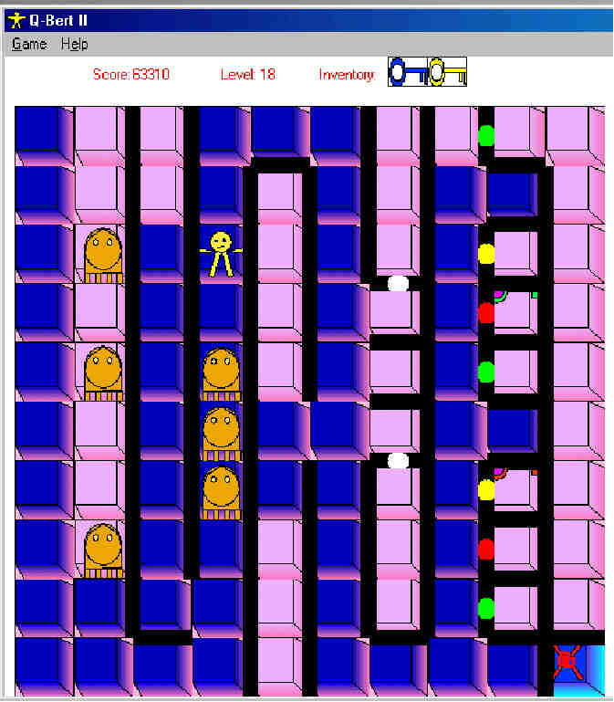



## Q\-Bert II

### Description

Q-Bert II is the totally new and improved version of Q-Bert. For those of you who don't know what Q-Bert is, it's a (2D) figure jumping around on cubes until he has jumped on all of them, ending the level. At least, that's what my version of the game is :)

Now, Q-Bert II has many new features over my first Q-Bert game, including:

-Ability to save high scores & games!

-Up to 999 levels total!

-More baddies!

-Doors and keys!

-Walls!

-Guns, so Q-Bert isn't defensless!

-Level Editor!

-Transporters to transport Q-Bert to the next level!

-Much more...

Make sure you check out the level editor, too; with it, you can easily make new levels. If you have any you think are good and you want them released, send them to me (you will get full credit for the levels, of course).

Included in the zip file are twenty levels, ranging from very, very easy (the first ten or so) to extremely hard. So if the first few levels are boring, just bear with the game for a while. ;) Or, you could just hack a save game.

The full source code is included, everything commented to the best of my abilities. Documentation is also included, as well as some tips on how to complete some of the later, harder levels.

Some features that one might be interested in, as a programmer,

-Saving/Loading files (+ common dialog interaction)

-Keyboard interaction

-Basic pathfinding (AI) algorithms

-Much, much more.. but check out the source code for yourself :)

For more levels and updates on Q-Bert II, see the Damadros Web-site

http://www.damadros.cjb.net
 
### More Info
 

             |
---                |---
**Submitted On**   |2002-08-28 17:50:28
**By**             |[Daniel Mayerson](https://github.com/Planet-Source-Code/PSCIndex/blob/master/ByAuthor/daniel-mayerson.md)
**Level**          |Intermediate
**User Rating**    |4.4 (22 globes from 5 users)
**Compatibility**  |VB 6\.0
**Category**       |[Games](https://github.com/Planet-Source-Code/PSCIndex/blob/master/ByCategory/games__1-38.md)
**World**          |[Visual Basic](https://github.com/Planet-Source-Code/PSCIndex/blob/master/ByWorld/visual-basic.md)
**Archive File**   |[Q\-Bert\_II125318912002\.zip](https://github.com/Planet-Source-Code/daniel-mayerson-q-bert-ii__1-38566/archive/master.zip)

